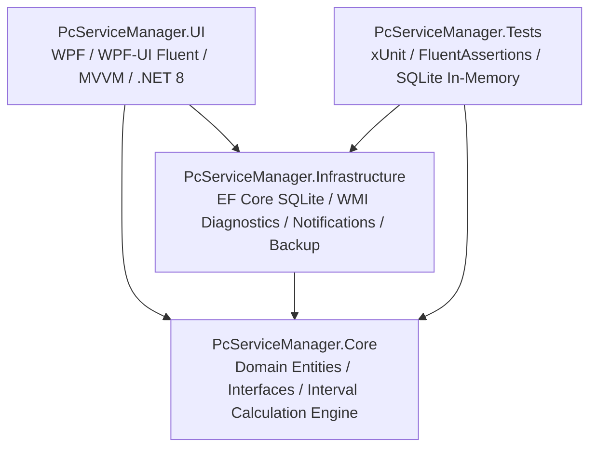

# PC Service Manager

> A modern Windows 11 desktop application that serves as a **digital service book and maintenance management suite for PCs**, similar to how a car has a complete vehicle service history.

[](https://dotnet.microsoft.com/)
[](https://learn.microsoft.com/en-us/dotnet/desktop/wpf/)
[](https://learn.microsoft.com/en-us/ef/core/)
[](tests/PcServiceManager.Tests)
[](LICENSE)

---

## Overview

**PC Service Manager** is designed for individuals who maintain Windows computers for family members, friends, clients, or their own workstations. It provides a structured, non-destructive maintenance workflow, tracks due dates across hardware and software categories, and permanently stores a timestamped record of every maintenance session.

### Core Philosophy: Safety First
PC Service Manager is a **maintenance assistant and service logger**, not an aggressive system cleaner.
* **Non-destructive by default**: No arbitrary file deletions or unsafe registry modifications.
* **Read-only diagnostics wherever possible**: Direct shortcuts to standard Windows administration consoles.
* **Explicit confirmation**: Any cleanup operation (e.g. temporary caches) is scanned, previewed, and requires explicit confirmation.
* **100% Local & Private**: No cloud accounts, telemetry, or third-party tracking. All data is saved in a local SQLite database.

---

## Key Features

```
┌────────────────────────────────────────────────────────────────────────┐
│                          PC SERVICE MANAGER                            │
│ ┌───────────────────────┐ ┌──────────────────────────────────────────┐ │
│ │ Brother-PC (Tower)    │ │ Overall Status: [ GOOD ]                 │ │
│ ├───────────────────────┤ ├──────────────────────────────────────────┤ │
│ │ Next: Windows Update  │ │ Overdue: 0       Due Soon: 2             │ │
│ │ In 6 days             │ │ Last Service: 17 Aug 2026 (42 min)       │ │
│ └───────────────────────┘ └──────────────────────────────────────────┘ │
│                                                                        │
│ [ Start Service ]  [ All Tasks ]  [ Service Book ]  [ PC Info ]        │
└────────────────────────────────────────────────────────────────────────┘
```

### 1. Modern Windows 11 Dashboard
* **Overall Health Status**: Dynamic calculated indicator (`GOOD` in Emerald Green, `DUE SOON` in Amber, `OVERDUE` in Crimson).
* **Upcoming Task Countdown**: Displays the next due task and remaining days.
* **Task Metrics**: Real-time counter of overdue, due soon, and healthy tasks.
* **Service Summary**: Details of the last completed maintenance session and quick-action navigation.
* **Recent History**: Quick overview of recent service logs.

### 2. Built-in Maintenance Categories & Tasks
Pre-populated with curated, safe maintenance tasks:
* **Software & Updates**:
  * Windows Update check (`ms-settings:windowsupdate`)
  * Hardware driver review & GPU updates (`devmgmt.msc`)
  * Startup applications review (`taskmgr.exe`)
  * Web browser & essential software update checks
* **Security & Integrity**:
  * Windows Security & Antivirus status check (`windowsdefender:`)
  * Data backup verification (External drives & cloud sync)
  * System file integrity check guide (`sfc /scannow` & `DISM`)
  * System restore points check
  * Laptop battery wear & health check (`powercfg /batteryreport`)
* **Storage & Performance**:
  * Disk space & Storage Sense (`ms-settings:storagesense`)
  * Safe temporary cache scanner & preview
* **Physical Hardware & Dust**:
  * Clean dust filters
  * Inspect fans & case interior for dust
  * Check operating temperatures & bearing fan noise
  * Inspect internal cables & connectors
  * Thermal paste replacement (Marked as `Advanced` with explicit safety warnings)
  * Laptop hinge & display bezel inspection
* **Peripherals & Workstation**:
  * Clean PC exterior & glass panels
  * Clean monitor, keyboard, and mouse
  * Inspect external USB ports

### 3. Guided Service Mode (Interactive Session)
* **Template Choices**: Select from **Quick Check** (4 items), **Regular Maintenance** (10 items), **Full Service** (17 items), or Custom.
* **Live Session Timer**: Real-time stopwatch tracking the exact duration of the maintenance session.
* **Interactive Task Cards**:
  * Mark status: `Completed` (Green), `Skipped` (Amber), `Needs Attention` (Red), `Not Applicable` (Gray).
  * Direct launch buttons for relevant Windows settings/tools.
  * Safety advisory banners for advanced procedures.
  * Individual observation and notes field for each task.
* **Service Completion & Next Due Recalculation**:
  * Duration and task outcome metrics.
  * General technician summary notes.
  * Automatically recalculates and updates `NextDueDate` and `LastPerformedDate` for all completed tasks in SQLite.

### 4. Digital Service Book (Service History)
* Complete chronological logbook matching an automotive service history.
* Drill-down detail viewer showing every task outcome, technician notes, and timestamps.
* **Export to CSV**: Formatted for spreadsheets and permanent digital archiving.
* **Copy Service Certificate**: Instant plain-text formatted service logbook report for clipboard.

### 5. Automatic PC Diagnostics & Safe Tools
* Safe, crash-proof hardware detection using WMI and `System.IO`:
  * Machine Name, Windows Version & OS Architecture
  * Processor (CPU) Model & Logical Cores
  * Physical RAM (Total & Available)
  * Graphics Adapter (GPU)
  * Motherboard & BIOS Version
  * Storage Drives with visual usage bars and low-space warnings
  * System Uptime
* Quick shortcuts to Windows Update, Security Center, Task Manager, Device Manager, Resource Monitor, Disk Management, and Event Viewer.
* **Safe Temporary Files Cleaner**: Scans user temp and crash dump caches, provides explicit previews and confirmation before deletion.

### 6. Settings, Backup & Data Portability
* **Multi-PC Support**: Create and maintain profiles for multiple computers (e.g. `Brother-PC`, `Office-Laptop`).
* **Configurable Schedule Threshold**: Adjust the "Due Soon" yellow badge threshold (1 to 30 days).
* **Theme Switching**: Dark Mode, Light Mode, and System Default Fluent theme.
* **Windows Notifications**: Desktop toast alerts on startup when maintenance tasks are overdue.
* **Full JSON Backup & Restore**: Complete atomic database backup and restore.

---

## Architecture & Technology Stack



| Layer | Technologies & Libraries |
| :--- | :--- |
| **Framework** | .NET 8.0 LTS (`net8.0-windows`) |
| **User Interface** | WPF, `WPF-UI` (Fluent Design System, Mica/Acrylic, Modern Controls) |
| **Architecture** | MVVM Pattern with `CommunityToolkit.Mvvm` |
| **Dependency Injection** | `Microsoft.Extensions.DependencyInjection`, `Microsoft.Extensions.Hosting` |
| **Database & ORM** | SQLite, `Microsoft.EntityFrameworkCore.Sqlite` |
| **Diagnostics** | `System.Management` (WMI), `System.IO.DriveInfo`, `System.Environment` |
| **Notifications** | Native Windows PowerShell / WinRT Toast Notifications |
| **Testing** | `xUnit`, `FluentAssertions`, SQLite in-memory provider |

---

## Project Structure

```
WARTUNG/
├── src/
│   ├── PcServiceManager.Core/               # Domain models, enums, calculation engine, interfaces
│   │   ├── Data/DefaultDataSeed.cs          # Default categories, tasks, and templates
│   │   ├── Entities/                        # PcAsset, MaintenanceTask, ServiceSession, etc.
│   │   ├── Enums/Enums.cs                   # DeviceType, IntervalType, MaintenanceStatus, etc.
│   │   ├── Interfaces/                      # Service contracts (Diagnostics, Actions, Database)
│   │   ├── Models/                          # DTOs, PcDiagnosticInfo, DriveInfoModel, BackupDto
│   │   └── Services/                        # MaintenanceScheduleCalculator
│   │
│   ├── PcServiceManager.Infrastructure/     # Persistence and OS integration
│   │   ├── Data/AppDbContext.cs             # EF Core SQLite DbContext & Entity Configuration
│   │   └── Services/                        # MaintenanceService, Diagnostics, Actions, Backup
│   │
│   └── PcServiceManager.UI/                 # WPF Application
│       ├── App.xaml / App.xaml.cs           # Host builder, DI container registration, Theme setup
│       ├── MainWindow.xaml                  # Windows 11 Fluent shell, Mica backdrop & Navigation
│       ├── Converters/                      # Value converters for status brushes and visibility
│       ├── ViewModels/                      # Dashboard, Maintenance, ServiceMode, History, etc.
│       └── Views/                           # Modern Fluent XAML UserControls
│
├── tests/
│   └── PcServiceManager.Tests/              # 22 Automated Unit & Integration Tests
│       ├── MaintenanceScheduleCalculatorTests.cs
│       ├── MaintenanceServiceTests.cs
│       ├── BackupExportServiceTests.cs
│       └── ServiceWorkflowTests.cs
│
├── PcServiceManager.sln                     # Visual Studio Solution
├── .gitignore
└── README.md
```

---

## Getting Started & Development

### Prerequisites
* Windows 10 (Build 19041+) or Windows 11
* [.NET 8.0 SDK](https://dotnet.microsoft.com/download/dotnet/8.0) or newer

### Building the Project
Clone the repository and build using the .NET CLI:

```powershell
# Restore dependencies and build
dotnet build

# Run all 22 automated tests
dotnet test
```

### Running the Application
```powershell
dotnet run --project src/PcServiceManager.UI
```

---

## Database Location
The SQLite database is stored locally in the user's Local Application Data directory:
```
%LOCALAPPDATA%\PcServiceManager\pc_service_manager.db
```
All tables and curated default tasks are automatically generated and seeded on first launch.

---

## Testing Suite
The test project (`tests/PcServiceManager.Tests`) covers:
* ✅ Maintenance interval date addition (Days, Weeks, Months, Years, Custom, One-time).
* ✅ Overdue and Due-Soon threshold calculation.
* ✅ Multi-task PC overall health resolution.
* ✅ Service session lifecycle, outcome metrics, and automated next-due date updates.
* ✅ Multiple PC asset management and switching.
* ✅ JSON database export, serialization, and atomic restore.
* ✅ CSV export generation and text certificate formatting.

---

## Contributing
Contributions and suggestions are welcome!
1. Fork the repository
2. Create your feature branch (`git checkout -b feature/AmazingFeature`)
3. Commit your changes (`git commit -m 'Add AmazingFeature'`)
4. Push to the branch (`git push origin feature/AmazingFeature`)
5. Open a Pull Request

---

## License
This project is licensed under the MIT License - see the [LICENSE](LICENSE) file for details.
